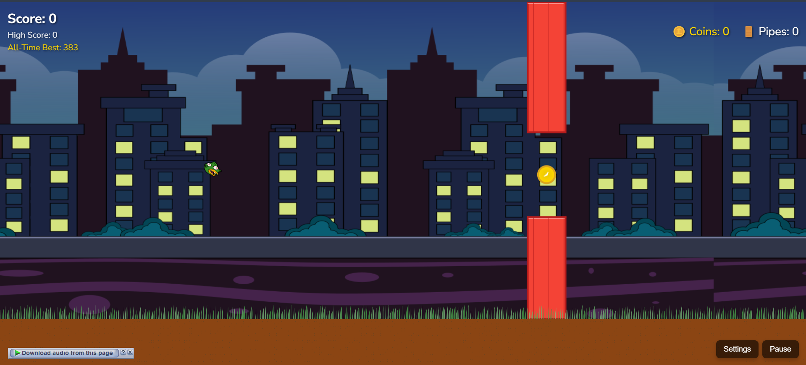

# Flippy Bird 🐦

## 🎮 Game Description

Flippy Bird is an enhanced, browser-based arcade game inspired by the classic Flappy Bird. Navigate your bird through an obstacle course of pipes, collect coins, and aim for the highest score possible!



## 🌟 Features

- **Responsive Design**: Playable on desktop and mobile devices
- **Multiple Bird Skins**: Choose from different bird colors
- **Background Themes**: Select from sky, city, and night backgrounds
- **Difficulty Levels**: Easy, Normal, and Hard modes
- **Customizable Settings**: 
  - Adjust bird and pipe styles
  - Control master, sound effects, and music volume
- **Score Tracking**: 
  - Current score
  - High score
  - All-time best record

## 🚀 Live Demo

Play the game here: [https://psyodrz.github.io/floppy-game/](https://psyodrz.github.io/floppy-game/)

## 🎮 How to Play

- **Desktop**: Click or press spacebar to make the bird flap
- **Mobile**: Tap the screen to make the bird flap
- Avoid hitting pipes
- Collect coins for bonus points
- Try to achieve the highest score possible!

## 🛠 Technologies Used

- HTML5
- CSS3
- JavaScript
- Canvas API

## 📦 Installation

1. Clone the repository
```bash
git clone https://github.com/psyodrz/floppy-game.git
```

2. Open `index.html` in your web browser

## 🔧 Customization

You can customize the game by modifying:
- Bird skins
- Background themes
- Pipe styles
- Difficulty levels
- Volume settings

## 🤝 Contributing

1. Fork the repository
2. Create your feature branch (`git checkout -b feature/AmazingFeature`)
3. Commit your changes (`git commit -m 'Add some AmazingFeature'`)
4. Push to the branch (`git push origin feature/AmazingFeature`)
5. Open a pull request

## 📄 License

Distributed under the MIT License. See `LICENSE` for more information.

## 🙌 Acknowledgments

- Inspired by the original Flappy Bird game
- Thanks to all contributors and game development enthusiasts!

## 📞 Contact

Your Name - [Your Email or Social Media]

Project Link: [https://github.com/psyodrz/floppy-game](https://github.com/psyodrz/floppy-game)
